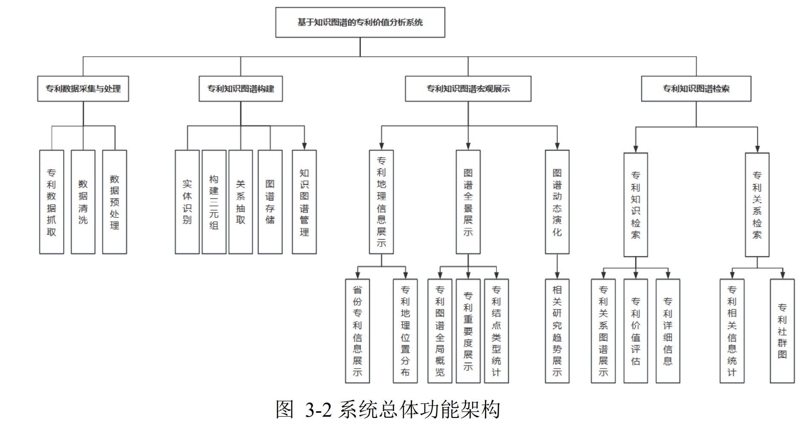
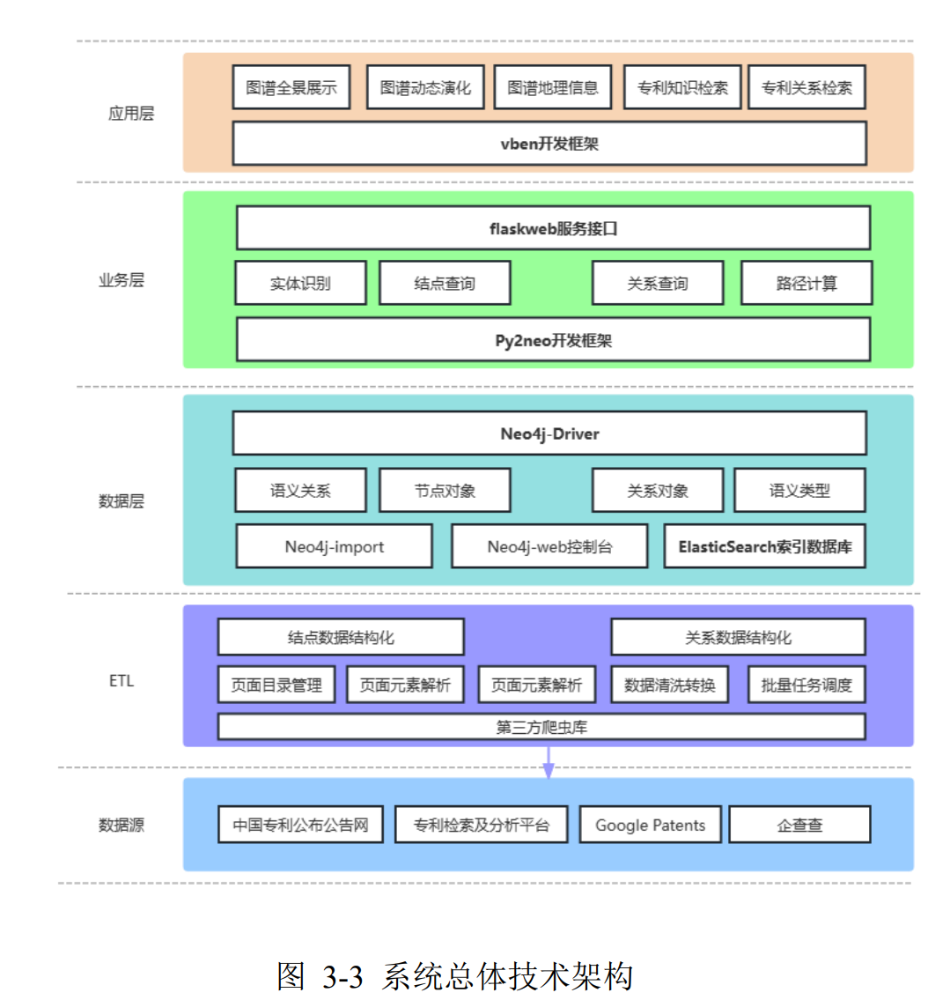
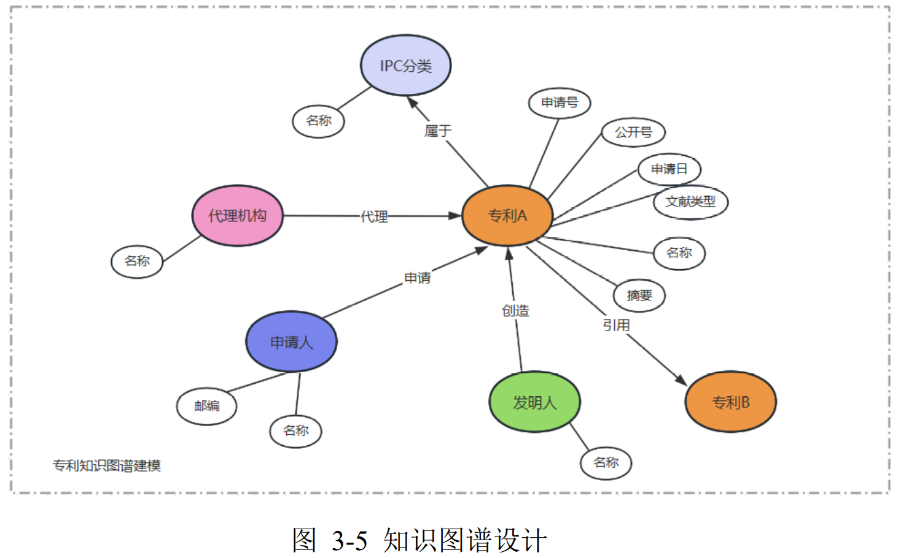
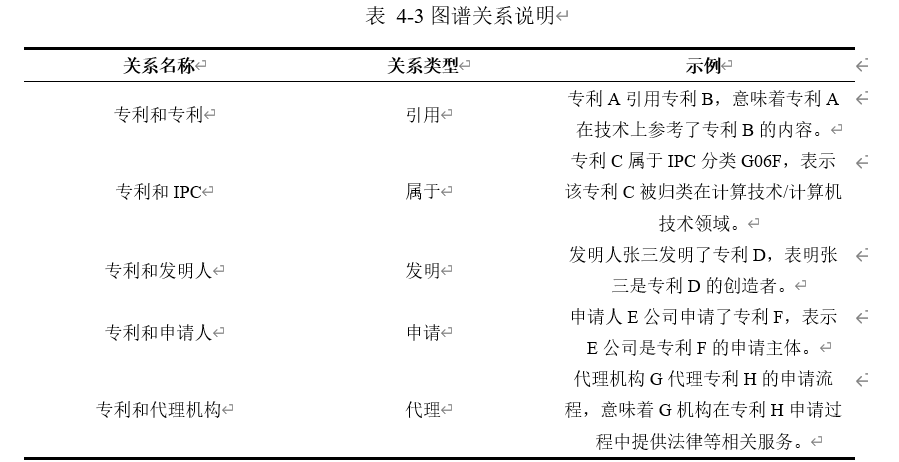
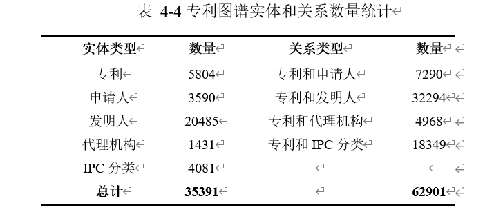
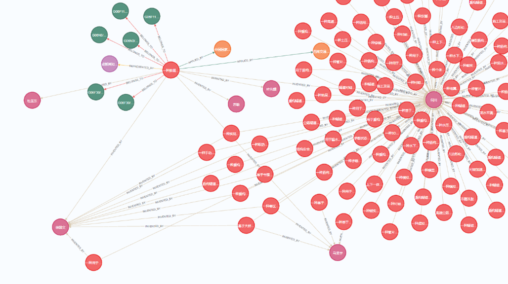
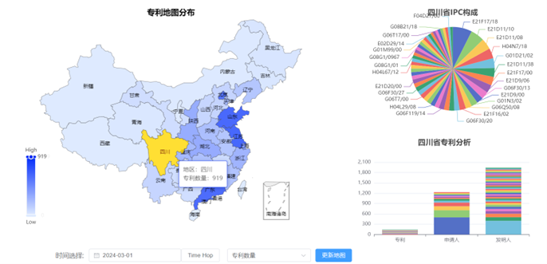
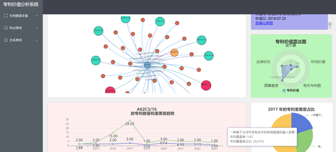
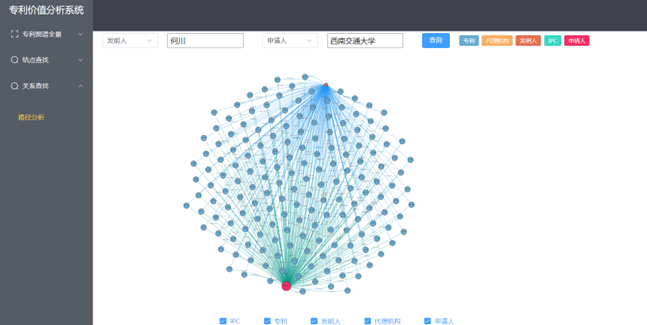
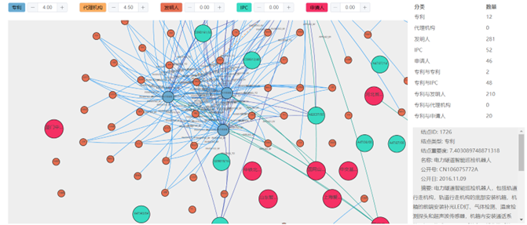

# 基于 Neo4j 的产业链知识图谱毕设项目

本仓库用于存放毕业设计相关代码与数据处理脚本，核心是 **Django + Neo4j** 的知识图谱系统，并包含独立的前端可视化项目与数据清洗脚本。

## 项目展示


### 系统架构







### 界面与功能效果







## 项目结构

- `longma-neo4j`：后端主项目（Django），负责知识图谱查询、页面渲染与用户模块。
- `前端/307/kg`：独立前端项目（Vue3 + ECharts + D3），用于图谱可视化展示。
- `数据/数据集处理`：数据集处理与图谱入库脚本（Python）。
- `前端/vben/vue-vben-admin`：第三方前端模板（可选，不是本项目核心业务代码）。

## 技术栈

- 后端：Django 3.2、py2neo、SQLite（开发态）
- 图数据库：Neo4j
- 前端：Vue3、Element Plus、ECharts、D3
- 数据处理：Python + CSV

## 快速开始

### 1) 启动后端（Django）

```bash
cd longma-neo4j
pip install -r requests.txt
python manage.py runserver
```

浏览器访问：`http://127.0.0.1:8000/`

### 2) 启动前端（可选）

```bash
cd 前端/307/kg
npm install
npm run serve
```

### 3) 数据处理脚本（可选）

```bash
cd 数据/数据集处理
python main.py
```

